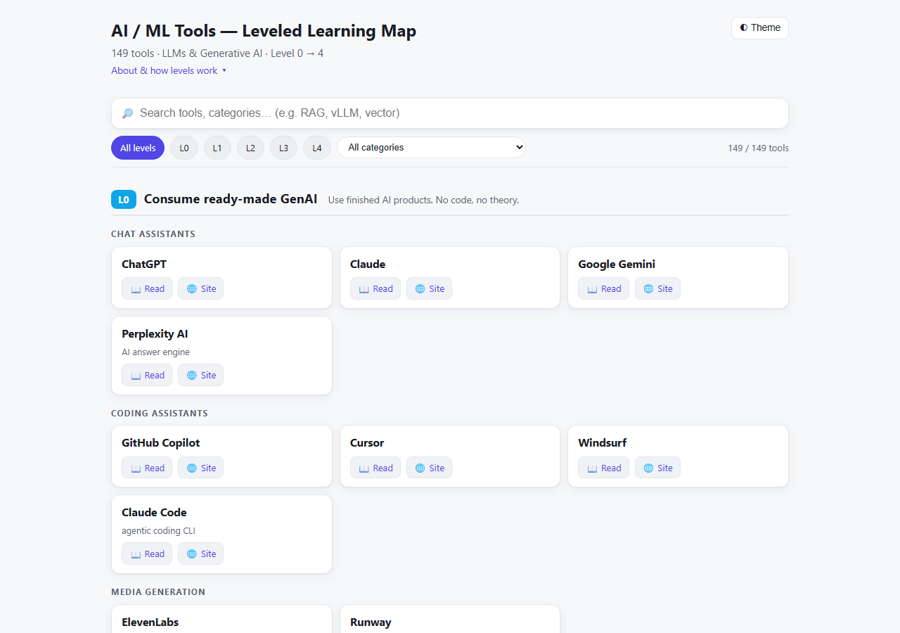

# Self-Serve Learnings 4 All

> An **awesome list of AI/ML tools — but leveled by concept depth (0→4) and searchable.**
> Pick your level, find the tool, get one thing to **read** and the **code**.

**🟢 Live — [open the searchable map »](https://maneesh-kumar-thakur.github.io/self-serve-learnings-4-all/)** — instant search, autocomplete, and Level/category filters. No signup, no tracking. *(Or open `index.html` locally.)*

⭐ **If this saves you time, star it** — it helps others find it.

## Contents

- [Why this is different](#why-this-is-different)
- [How the levels work](#how-the-levels-work)
- [Areas](#areas)
- [Contributing](#contributing)
- [Under the hood](#under-the-hood)
- [License](#license)

## Why this is different

Most awesome lists are a static wall of markdown links. This one is a **searchable app** over 210+ AI/ML tools (starting with LLMs & Generative AI), and every tool has exactly two links:

- **📖 Read** — an approachable article or tutorial to *understand* it.
- **🐙 Code** — its repo (or homepage, if it isn't open source).

The differentiator is the ordering: tools are sorted by **concept depth (Level 0 → 4)** — how much you need to *understand* to use them — which no mainstream awesome-AI list does. Plus search, autocomplete, and Level/category filters on top.

## How the levels work

**Level 0** = use ready-made tools, no theory needed → **Level 4** = research- and production-scale depth. Levels measure how much you need to *understand* to really use a tool — not how hard it is to click. (ChatGPT is easy to use at Level 0, even though the ideas behind it are advanced.)

| Level | Meaning | Examples |
|---|---|---|
| **0** | Consume ready-made GenAI — no code | ChatGPT, Claude, Copilot |
| **1** | Run & build with no/low code | Ollama, Flowise |
| **2** | Code with high-level libraries | OpenAI SDK, LangChain |
| **3** | Build, fine-tune & ship | LangGraph, Pinecone, PEFT |
| **4** | Research & scale | vLLM, DeepSpeed, FlashAttention |

## Areas

| Area | What's inside | Status |
|---|---|---|
| AI / ML | Tools & platforms by **concept depth** (Level 0→4). First up: **LLMs & Generative AI** (210+ tools). | ✅ Live |
| _more coming_ | New areas, same style | 🔜 |

## Contributing

New tools are welcome — that's how the map grows. It's one entry in [`data/catalog.js`](data/catalog.js), and the site updates automatically.

- **Add a tool:** see **[CONTRIBUTING.md](CONTRIBUTING.md)** for the entry format and level guide.
- **Prefer not to touch code?** Open a **[Suggest a tool](../../issues/new/choose)** issue.
- **Found a dead link?** Open a **[Report a broken link](../../issues/new/choose)** issue.

Every contribution is validated by CI (structure + link-liveness) before merge.

## Under the hood

- **`index.html`** — the self-contained search app (no build step, no external libraries).
- **`data/catalog.js`** — the single source of truth: every tool with its level, category, Read link, and Code link.
- **`scripts/`** — `validate` (structure), `linkcheck` (link liveness), `build:seo` (crawlable content + sitemap).

## License

[CC0 1.0](LICENSE) — public domain. Copy, remix, and reuse freely, no attribution required.
